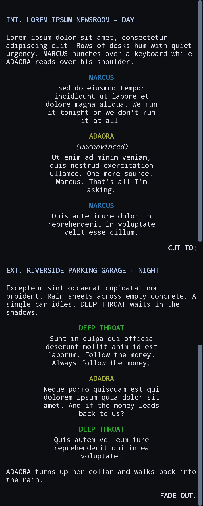
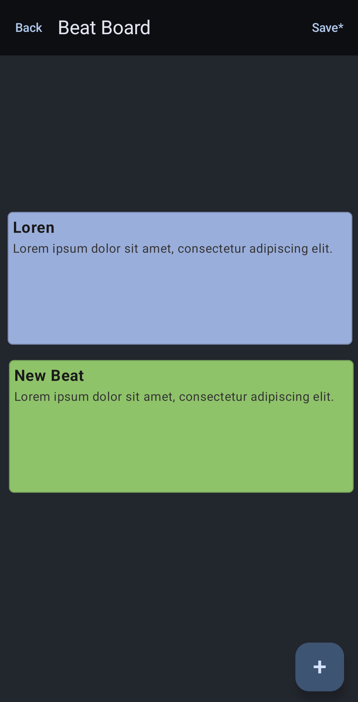

# FDX Writer

An Android app for reading and editing **Final Draft** screenplays (`.fdx`) on the go — built with Kotlin and Jetpack Compose.

FDX Writer opens real Final Draft files, lets you edit the screenplay, beat board, and notes, and writes them back **losslessly**: anything it doesn't touch is preserved so the file stays compatible with Final Draft.

## Screenshots

<p align="center">
  
  &nbsp;&nbsp;
  
</p>

## Download

Grab the latest APK from the [**Releases**](https://github.com/GunnarHeadley/fdxwriter/releases) page and install it on any device running **Android 7.0 (API 24)** or newer. The current build is an early **pre-release** (`v0.1.0`) — the first time you sideload it you'll need to allow "install unknown apps" for your browser or file manager.

## Features

- **Open, create, and save `.fdx`** files via the Android Storage Access Framework — edit in place or start a new blank script.
- **Screenplay editor** with the usual element types (Scene Heading, Action, Character, Dialogue, Parenthetical, Transition…) and screenplay-style layout — the view follows your cursor as you type and sentences auto-capitalize.
- **Word-processor-style rich text** — **bold** / *italic* / underline that holds as you type through a sentence and stays put when you backspace over it.
- **Final Draft–style editing** — element switching, Enter creates the next logical element, and Backspace on an empty line merges it into the previous one.
- **SmartType suggestions** — autocompletes character names (ordered by most-recently-used), scene-heading openers (`INT.` / `EXT.`), and common transitions; picking a character name drops you straight into their dialogue.
- **Color-coded character names** — each speaker gets a consistent color so scenes are easy to scan (toggle in settings).
- **Resume where you left off** — each script reopens at the position you were last editing.
- **Scene outline** — jump straight to any scene from a quick list.
- **Approximate page breaks** — optional in-editor markers showing where printed pages fall, tuned to line up closely with Final Draft's pagination (toggle in settings).
- **Beat board** — a pannable, zoomable canvas of draggable, resizable beat cards using Final Draft's color palette.
- **Script notes** — review, add, edit, and remove notes; they're highlighted inline in the script and can be added straight from the text-selection menu.
- **Search** and **find / replace** across the whole script.
- **Statistics** — scene, word, and estimated page counts, plus dialogue blocks per character.
- **PDF export** — outputs a standard Courier screenplay layout on US-Letter pages.
- **Undo / redo** and **auto-save** with a configurable interval.
- **Change-safe saving** — detects when the file was genuinely edited elsewhere (e.g. a cloud-synced copy open in Final Draft) and offers to reload, overwrite, or save a copy instead of silently clobbering it.
- **Settings** — editor text size, a light / dark / system theme, character-name coloring, and optional page-break markers.
- **Net-change tracking** — Save only enables when the document actually differs from what's on disk.

## Tech stack

- **Kotlin** + **Jetpack Compose** (Material 3)
- **MVVM** — `ViewModel` + `StateFlow`
- **DataStore** for settings, the recent-files list, and per-script scroll position
- **Storage Access Framework** for file I/O with persistable URI permissions
- A dependency-free, **DOM-based FDX parser/serializer** (`javax.xml`) that keeps the full document and only rebuilds the sections you edit

## Architecture

The guiding principle is a **lossless DOM round-trip**: the entire `.fdx` XML is parsed into a DOM, only the editable sections (Content paragraphs, beat list items / display board, and script notes) are regenerated on save, and everything else is written back exactly as it was.

```
app/src/main/java/com/gunnarheadley/fdxwriter/
├── data/
│   ├── fdx/     # FDX model, parser, serializer, offset mapping, colors, stats, text edits
│   ├── repo/    # ScriptRepository (SAF I/O), SettingsStore, RecentFilesStore, EditorPositionStore (DataStore)
│   └── export/  # PDF exporter
└── ui/
    ├── editor/      # screenplay editor, format bar, rich-text codec
    ├── beatboard/   # beat board canvas
    ├── notes/       # notes list + note editor
    ├── settings/    # settings screen
    ├── common/      # shared UI (color picker)
    ├── theme/       # Compose theme
    └── AppScreen · HomeScreen · ScriptViewModel
```

## Build & run

Requirements:

- Android Studio (latest) or the Android SDK with **API 36** installed
- **JDK 17+** (the JBR bundled with Android Studio works)

```bash
# Build and install a debug build on a connected device / emulator
./gradlew installDebug

# Run the unit tests
./gradlew testDebugUnitTest
```

- **Minimum Android version:** API 24 (Android 7.0)
- **Target / compile:** API 36

## Testing

The pure logic — FDX parse / serialize / round-trip, offset mapping, and find/replace run editing — is covered by JVM unit tests that build small synthetic screenplays in code, so no external sample files are needed.

```bash
./gradlew testDebugUnitTest
```

## Contributing

Contributions are welcome!

- **Issues:** Report bugs or request features on the [issue tracker](https://github.com/GunnarHeadley/fdxwriter/issues). For bugs, include your Android version and, where possible, a small `.fdx` that reproduces the problem.
- **Pull requests:**
  1. Fork the repo and create a feature branch off `main`.
  2. Keep the **lossless FDX round-trip** intact — only regenerate the sections you actually edit and preserve everything else verbatim.
  3. Match the existing style: Kotlin, Jetpack Compose (Material 3), and the MVVM (`ViewModel` + `StateFlow`) structure.
  4. Add JVM unit tests for any pure logic (parsing, serialization, offset mapping, editing) and make sure `./gradlew testDebugUnitTest` passes.
  5. Open a PR against `main` describing the change and how you tested it.

Please keep pull requests focused and free of unrelated formatting churn.

## Limitations

- Editing a paragraph preserves **bold / italic / underline**; other Final Draft run attributes (font, size, color) on an edited paragraph are not user-editable.
- **PDF export** uses a standard Courier layout and approximates page breaks — it isn't Final Draft's exact repagination.

## License

Released under the [MIT License](LICENSE).
